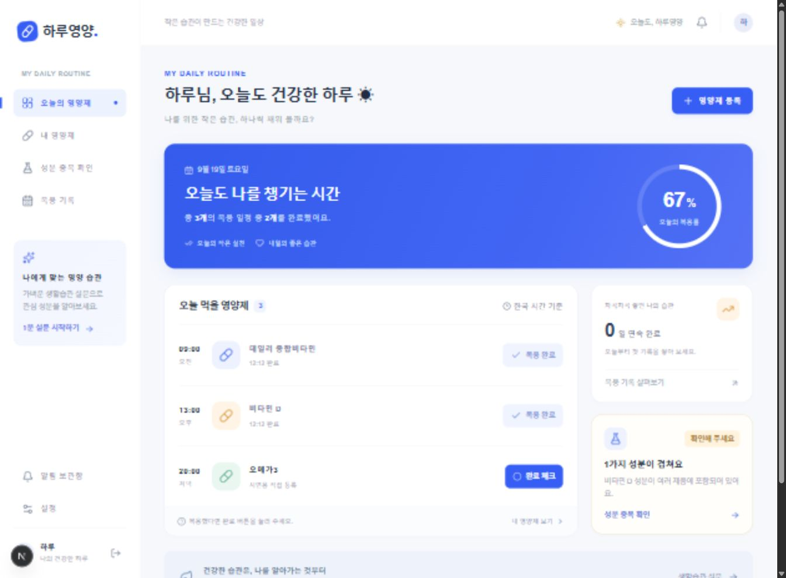
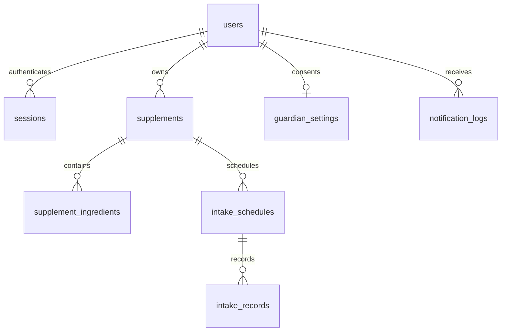

# 하루영양 · Haru Nutri

오늘의 영양제, 가볍게 챙기는 나의 루틴.

하루영양은 영양제 등록, 시간별 복용 체크, 성분 중복 확인, 복용 기록과 이메일 알림을 연결한 해커톤용 웹서비스입니다. 회원가입부터 데이터 저장까지 로컬에서 실제로 동작합니다. 외부 서비스 계정이 없어도 실행할 수 있고, Resend를 연결하면 실제 이메일을 발송할 수 있습니다.

[실행 중인 서비스](https://haru-nutri-production.up.railway.app) · [GitHub 저장소](https://github.com/june-young19/haru-nutri) · [외부 배포 가이드](docs/DEPLOYMENT.md) · [시연 가이드](docs/DEMO.md)

Railway에 웹과 알림 워커를 배포했습니다. 공개 HTTPS 주소에서 실제 회원가입·영양제 저장·복용 완료·계정 분리와 웹 재시작 후 데이터 보존을 확인했습니다. 실제 자동 알림 1통의 발송, Resend `Delivered`, Gmail 서버 수락과 **사용자 본인의 실제 Gmail 수신 확인**까지 완료했습니다.

**설문과 성분 안내는 생활습관을 돌아보기 위한 참고 정보입니다. 의학적 진단·치료·복용 처방을 제공하지 않으며, 성분 중복 자체를 위험하다고 판단하지 않습니다.**



[모바일 화면 보기](docs/screenshots/dashboard-mobile.png)

## 1. 주요 기능

- 이메일·비밀번호·이름·나이 회원가입, 로그인·로그아웃, 사용자별 데이터 분리
- 첫 시작 선택: 생활습관 설문 또는 바로 영양제 등록
- 제품별 여러 성분과 하루 복용 시간 등록·수정
- 오늘의 시간순 복용 일정, 완료·취소, 완료 시각과 복용률 저장
- 제품 간 같은 성분 강조, 단위가 호환되는 경우 하루 등록량 합산
- 이름·나이를 유지하는 프로필, 공식 자료의 연령별 상한섭취량(UL) 참고 비교
- 새 제품·수정 제품을 합산한 저장 전 미리보기와 상한량 초과 시 확인 단계
- 제품 삭제 즉시 오늘의 일정·진행률·성분 분석에서 제외, 기존 기록은 보관
- 최근 날짜별 복용 기록과 연속 완료 기록
- 본인 알림, 별도 동의한 보호자 알림, 알림 내역 확인
- 실제 Resend 이메일 모드와 외부 전송 없는 로컬 캡처 모드
- PC·모바일 반응형 화면, 비어 있는 계정에서도 시작할 수 있는 안내

사진 인식, 바코드 검색, AI 챗봇은 포함하지 않습니다. 설문은 명시적인 규칙으로 결과를 만드는 방식이며, 생성형 AI나 임상 진단 모델로 소개하지 않습니다.

## 2. 기술과 선택 이유

| 영역      | 구현                                                          |
| --------- | ------------------------------------------------------------- |
| 웹        | Next.js 16 App Router, React 19, TypeScript                   |
| 스타일    | Tailwind CSS 4, CSS, Lucide 아이콘                            |
| 인증      | 서버의 scrypt 비밀번호 해시, 서버 세션, HttpOnly 쿠키         |
| 데이터    | SQLite, Node.js 내장 `node:sqlite`                            |
| 이메일    | Resend HTTP API 또는 로컬 DB 캡처                             |
| 예약 실행 | 별도 Node.js 워커 → 인증된 알림 API를 매분 호출               |
| 배포      | Docker, 영구 디스크를 제공하는 단일 서버                      |
| 검증      | TypeScript, Node 테스트 러너, API 통합 테스트, GitHub Actions |

권장안의 Supabase 대신 SQLite와 서버 인증을 사용했습니다. **외부 API Key와 DB 계정 없이 clone → 설치 → 회원가입 → 실제 저장까지 재현**할 수 있어 발표 현장의 네트워크·계정 설정 의존성을 줄입니다. 데이터 모델은 관계형으로 구성했습니다.

이 선택에는 범위가 있습니다. 영구 디스크를 가진 **앱 서버 한 개**로 운영하며, Vercel/Netlify의 서버리스 함수나 정적 호스팅에 그대로 배포하는 구성은 지원하지 않습니다. 다중 인스턴스가 필요한 서비스로 확장하려면 PostgreSQL/Supabase 및 인증 체계로 이전하는 개발이 필요합니다. 현재 프로젝트에 Supabase API Key를 넣는 것만으로 전환되지는 않습니다.

## 3. 빠른 시작

준비물: **Node.js 22.13 이상인 22.x 최신 패치 버전**, Git. Node.js 22.13부터 이 프로젝트에서 사용하는 SQLite 모듈을 별도 실행 플래그 없이 사용할 수 있습니다. 해당 버전에서는 실험적 API 경고가 표시될 수 있습니다. [Node.js SQLite 문서](https://nodejs.org/download/release/v22.13.0/docs/api/sqlite.html)

```bash
git clone https://github.com/june-young19/haru-nutri.git
cd haru-nutri
corepack enable
corepack prepare pnpm@11.19.0 --activate
pnpm install --frozen-lockfile
```

Corepack이 없는 Node.js 설치라면 `npm install -g pnpm@11.19.0`으로 pnpm을 설치할 수 있습니다. 자신의 Fork를 사용하는 경우 해당 저장소 URL로 바꾸세요.

환경 파일을 복사합니다.

```bash
# macOS / Linux
cp .env.example .env
```

```powershell
# Windows PowerShell
Copy-Item .env.example .env
```

API Key 없이 시연하려면 복사한 `.env`에서 **`EMAIL_MODE=capture`로 변경**합니다. `.env.example`의 `EMAIL_MODE=resend`, 빈 `RESEND_API_KEY`, 빈 `EMAIL_FROM`은 실제 이메일 연결을 위한 자리이며, 그대로는 실제 이메일을 발송할 수 없습니다.

```bash
pnpm dev
```

[http://localhost:3000](http://localhost:3000)을 열고 이름·나이·이메일·비밀번호로 회원가입합니다. 나이는 1~120의 정수이며, 만 나이를 입력합니다. 로컬 `capture` 모드에는 API Key가 필요하지 않습니다. 기본 공유 계정이나 자동 생성된 사용자는 없습니다.

빈 대시보드의 “예시 성분을 확인하고 등록하기”는 종합비타민 초안을 편집기에 채웁니다. 데이터를 자동으로 저장하지 않으며, 직접 입력한 제품과 같은 성분 검사·필요 시 경고 확인·저장 순서를 거칩니다.

## 4. 환경변수

값은 프로젝트 루트의 `.env` 또는 배포 서비스의 환경변수 설정에 넣습니다. `.env`, SQLite DB, 빌드 결과와 의존성 폴더는 Git에 올리지 않습니다. 시크릿을 `NEXT_PUBLIC_` 변수로 만들지 마세요.

| 변수             | 로컬 예시               | 설명                                                       |
| ---------------- | ----------------------- | ---------------------------------------------------------- |
| `APP_URL`        | `http://localhost:3000` | 브라우저에서 접속할 앱의 기준 주소. 운영은 `https://` 주소 |
| `DATABASE_PATH`  | `./data/haru.db`        | SQLite 파일 위치. 운영에서는 영구 디스크의 절대 경로       |
| `EMAIL_MODE`     | `capture`               | `capture` 또는 `resend`                                    |
| `RESEND_API_KEY` | 빈 값                   | `resend`일 때 발급받은 서버 전용 키                        |
| `EMAIL_FROM`     | 빈 값                   | 실제 발송 시 `하루영양 <reminder@검증한도메인>`으로 설정   |
| `CRON_SECRET`    | 직접 생성               | 알림 워커와 서버가 공유하는 충분히 긴 임의 문자열          |
| `TRUST_PROXY`    | `false`                 | 신뢰하는 프록시가 IP 헤더를 덮어쓸 때만 `true`로 변경      |
| `TZ`             | `Asia/Seoul`            | 프로세스 시간대. 앱 일정은 별도로 한국 시간에 고정         |

다음 명령으로 시크릿을 생성하고 출력값을 `.env`의 `CRON_SECRET=` 뒤에 붙여 넣습니다.

```bash
node -e "console.log(require('node:crypto').randomBytes(32).toString('hex'))"
```

**Supabase 설정은 필요 없습니다.** 이 버전은 Supabase Auth·DB를 사용하지 않습니다. 로컬 회원가입·저장에는 어떤 외부 API Key도 필요하지 않고, 실제 이메일 발송에만 Resend 계정과 발신자 설정이 필요합니다.

`.env`를 바꾸면 개발 서버와 워커를 재시작합니다. 워커는 `.env`를 읽으며, Next.js 전용 `.env.local`만 사용하는 경우 워커에는 값이 전달되지 않습니다.

## 5. 데이터베이스

앱이 DB를 처음 사용할 때 `DATABASE_PATH`의 상위 디렉터리와 테이블을 자동으로 생성합니다. 별도 PostgreSQL 설치나 수동 SQL 실행은 필요하지 않습니다. `data/haru.db`가 실제 데이터이므로 앱을 재시작해도 유지됩니다.

| 테이블                   | 역할과 관계                                            |
| ------------------------ | ------------------------------------------------------ |
| `users`                  | 이메일, 이름, 나이, 비밀번호 해시, 시작 과정·알림 설정 |
| `sessions`               | 사용자별 서버 로그인 세션                              |
| `auth_attempts`          | 회원가입·로그인 요청 제한을 위한 해시된 버킷           |
| `supplements`            | 사용자에게 속한 영양제                                 |
| `supplement_ingredients` | 영양제에 속한 여러 성분·함량·단위                      |
| `intake_schedules`       | 영양제의 여러 복용 시각                                |
| `intake_records`         | 날짜·일정별 복용 상태와 완료 시각                      |
| `guardian_settings`      | 사용자별 보호자 이메일과 명시적 알림 동의              |
| `notification_logs`      | 대상·날짜·일정별 알림 상태, 캡처 내용, 발송 결과       |



사용자 ID는 로그인 세션에서 결정합니다. 다른 사용자의 제품 ID를 URL이나 요청에 넣어도 소유권을 확인하는 서버 조회를 통과해야 합니다. DB는 브라우저에 직접 공개되지 않습니다. 자세한 인증·동의·운영 범위는 [보안 설명](docs/SECURITY.md)에 있습니다.

### 기존 DB 업그레이드

이름·나이 도입 전 DB도 삭제하거나 새로 가입할 필요가 없습니다. 서버가 기존 `nickname` 데이터를 `name`으로 이전하고 기존 계정의 `age`는 `NULL`로 둡니다. 로그인·영양제·성분·일정·복용 기록은 유지합니다. 기존 사용자에게 나이를 임의로 추정해 넣지 않으며, 설정에서 나이를 입력하기 전에는 연령별 비교가 필요한 항목을 “나이 입력 필요”로 안내합니다.

운영 DB 업그레이드는 앱과 워커를 정상 종료하고 아래의 백업 절차를 완료한 뒤 실행하세요. 스키마 버전은 SQLite `user_version=2`이며, 열 이름 변경과 나이 추가를 하나의 트랜잭션에서 수행합니다. 변경 후 구버전 서버는 이전 열 이름을 사용할 수 없으므로 구·신버전 서버를 같은 DB에 동시에 실행하지 않습니다. 업데이트 후 기존 계정으로 로그인해 이름·영양제·완료 기록을 확인하고 나이를 입력합니다. 나이는 생년월일에서 자동 증가하는 값이 아니므로 설정에서 직접 갱신합니다.

### 시간과 함량의 의미

- 일정과 날짜 경계는 **Asia/Seoul(한국 시간)** 기준입니다. 해외에서 접속해도 동일합니다.
- 입력하는 성분 함량은 해당 제품의 **하루에 먹는 양 전체에 포함된 함량**입니다. 하루 두 번 먹는 제품도 하루 총량을 한 번 입력합니다. 복용 횟수를 다시 곱하지 않습니다.
- 복용률은 제품 개수가 아닌 **오늘의 복용 일정 건수** 기준입니다. 한 제품을 두 번 먹으면 두 건입니다.
- 오늘 완료한 기록이 있는 제품의 일정을 수정하면 변경 일정은 다음 날부터 적용해 오늘의 완료 기록을 보존합니다. 완료 기록이 없으면 당일부터 적용합니다.
- 제품을 삭제하면 그 제품은 완료 여부와 관계없이 오늘의 일정·분모·완료 건수·성분 중복·상한량 비교에서 즉시 빠집니다. 기존 완료 기록은 삭제된 제품의 읽기 전용 이력으로 보관하며, 삭제를 취소하거나 보관된 제품을 다시 체크하는 기능은 제공하지 않습니다.
- 같은 성분이 둘 이상의 제품에 있으면 중복으로 표시합니다. `g`, `mg`, `μg` 등 호환되는 질량 단위는 환산해 합산하고, `IU`는 질량 단위와 임의로 합치지 않습니다.
- “등록된 총량”은 라벨과 사용자가 입력한 계획량입니다. 식사·미등록 제품을 포함한 실제 섭취량이나 적정량을 판정한 값이 아닙니다.
- 설문 결과는 성분별 관심 안내입니다. 피로·수면 같은 응답만으로 특정 영양소 부족이나 치료 필요성을 판단하지 않습니다.

### 연령별 상한섭취량(UL) 참고 비교

성분 중복과 별개로 **활성 영양제에 등록한 하루 함량**을 공식 자료의 연령별 UL과 비교합니다. UL은 권장 복용량·목표량이 아닙니다. `within`은 등록한 함량의 비교 결과이며, 개인에게 안전하거나 영양이 충분하다는 보장이 아닙니다. 식사·미등록 제품·약물·임신·수유·질환 정보는 이 앱에 충분히 입력되어 있지 않습니다.

출처는 **미국 NIH Office of Dietary Supplements가 공개한 FNB의 DRI 표**입니다. 한국인을 위한 국내 기준이라고 표시하지 않습니다. 지원 표의 적용 연령·단위·출처 URL·출처 문서 개정 연도·버전·적용 범위는 [공식 기준 자료](lib/ul-reference.ts)에, 합산·비교는 [분석 로직](lib/safety.ts)에 보관합니다. 앱의 출처 링크로도 확인할 수 있습니다. 공식 자료를 실시간 갱신하는 API가 아니므로 기준 변경 시 자료와 테스트를 함께 갱신해야 합니다.

| 처리                | 성분과 기준                                                                                                                                   |
| ------------------- | --------------------------------------------------------------------------------------------------------------------------------------------- |
| 연령별 수치 UL 비교 | 비타민 C·D, 칼슘, 철, 아연, 셀레늄, 마그네슘                                                                                                  |
| 섭취 범위           | 마그네슘은 보충제·약물 유래 양에 적용. 나머지 지원 성분은 식품·음료·보충제를 합한 총섭취 기준이므로 앱 등록량만으로 전체 섭취를 평가하지 않음 |
| 단위                | g·mg·μg 질량 환산. 비타민 D에 한해 공식 환산인 40IU=1μg 적용. 다른 성분 IU는 질량과 임의로 합치지 않음                                        |
| 자료의 UL 미설정    | 비타민 B12·오메가3 등은 `no_ul`. “상한량 없음”을 무제한 섭취 가능으로 해석하지 않음                                                           |
| 형태 확인 필요      | 비타민 A·E·니아신·엽산 등은 현재 입력만으로 적용 형태를 구분할 수 없어 `form_required`로 표시                                                 |
| 판단 불가           | 지원하지 않는 성분은 `unknown`, 호환되지 않는 단위는 `unit_mismatch`, 기존 계정의 나이 미입력은 `age_required`                                |

공식 근거: [비타민 D](https://ods.od.nih.gov/factsheets/VitaminD-HealthProfessional/), [비타민 C](https://ods.od.nih.gov/factsheets/VitaminC-Consumer/), [칼슘](https://ods.od.nih.gov/factsheets/Calcium-Consumer/), [마그네슘](https://ods.od.nih.gov/factsheets/Magnesium-Consumer/), [철](https://ods.od.nih.gov/factsheets/Iron-Consumer/), [아연](https://ods.od.nih.gov/factsheets/Zinc-Consumer/), [셀레늄](https://ods.od.nih.gov/factsheets/Selenium-HealthProfessional/). 원문의 반올림 표시나 미국 FNB와 다른 기관 기준의 차이는 해당 자료의 주석에 명시합니다.

영양제 등록·수정 화면에서 저장 전 합계를 확인합니다. 예를 들어 만 30세 계정에 비타민 D 45μg이 등록되어 있고 새 제품 80μg을 추가하면 합계 125μg이 연령별 UL 100μg을 초과한다고 표시합니다. 이는 시연용 수치 비교이며 복용 권고가 아닙니다. 초과 항목이 있으면 경고를 읽고 명시적으로 확인해야 저장할 수 있고, 서버도 확인 없는 저장 요청을 HTTP 409로 거부합니다. 수정 미리보기는 교체할 기존 제품을 제외한 뒤 새 함량을 더해 이중 합산을 피합니다.

API 계약은 `GET /api/safety`(현재 등록분), `POST /api/safety/preview`(전체 제품 초안과 선택적 `excludeSupplementId`)입니다. 항목의 `currentTotals`는 교체 대상 제외 기존 합계, `proposedTotals`는 제품 초안의 하루분, `totals`는 둘의 합계입니다. 저장 요청의 `safetyAcknowledged: true`는 초과 경고를 확인했다는 뜻이며 의학적 안전 승인이 아닙니다.

### 데이터 보관과 백업

GitHub에 DB를 올리는 대신 운영 디스크를 백업합니다. 가장 간단한 백업은 앱과 워커를 정상 종료한 뒤 **DB가 있는 디렉터리 전체**를 별도 보관하고 재시작하는 방법입니다. 실행 중인 SQLite 파일 하나만 복사하면 WAL에 남은 최신 변경을 놓칠 수 있습니다. 복원은 서비스를 멈춘 상태에서 수행합니다. 테스트는 운영 DB와 별도 경로를 사용합니다.

## 6. 이메일 알림 연결

### A. API Key 없는 시연

`EMAIL_MODE=capture`에서는 이메일을 외부에 보내지 않고 알림 내용과 처리 상태를 DB에 저장합니다. 로그인 후 알림 내역 화면에서 수신자·제목·본문을 확인합니다. **캡처는 이메일 전송 성공이 아닙니다.**

일정 알림을 실행하려면 `.env`의 `CRON_SECRET`을 설정하고, 앱이 실행 중인 상태에서 두 번째 터미널을 엽니다.

```bash
pnpm reminders
```

워커는 시작 직후 `GET /api/cron/notifications`를 호출하고 요청이 끝난 뒤 60초 후 다시 실행합니다. 느린 요청이 겹치지 않으며, 실패하면 다음 주기에 재시도합니다. 서버와 워커가 같은 `CRON_SECRET`을 사용해야 합니다. 브라우저를 닫아도 두 프로세스가 실행 중이면 알림 처리를 계속할 수 있습니다. 노트북이 잠들거나 서버가 정지하면 해당 시간의 알림은 처리되지 않습니다.

기본 유예 시간은 예정 시간 후 본인 30분, 본인 알림 처리 후 보호자 120분이며 설정 화면에서 바꿀 수 있습니다. 자정을 넘기는 알림도 처리합니다. 본인 알림은 예정 시각으로부터 24시간 이내, 보호자 후속 알림은 기존 본인 알림을 기준으로 예정 시각으로부터 최대 52시간 이내에 처리합니다. 오래된 미확인 일정을 무한히 재발송하지 않습니다. 최근 7일 동안 실제로 존재했던 자신의 일정은 복용 기록 화면에서 빠뜨린 체크를 보완할 수 있습니다. 저장 시각은 실제 섭취 시각을 추정하지 않고 체크한 시각으로 남습니다.

### B. 실제 Resend 발송

1. [Resend](https://resend.com) 계정을 만들고 [API Keys](https://resend.com/api-keys)에서 발송용 키를 발급합니다. [공식 키 관리 안내](https://resend.com/docs/dashboard/api-keys/introduction)
2. 실제 사용자와 보호자에게 보내려면 소유한 도메인을 등록하고 안내된 DNS 레코드를 추가해 검증합니다. `EMAIL_FROM`을 그 도메인의 주소로 설정합니다. 테스트 발신자 `onboarding@resend.dev`에는 수신자 제한이 있으므로 모든 주소에 보낼 수 있다고 가정하지 마세요. [도메인 검증](https://resend.com/docs/dashboard/domains/introduction)
3. 환경변수를 바꾸고 앱과 워커를 재시작합니다.

```dotenv
EMAIL_MODE=resend
RESEND_API_KEY=re_YOUR_REAL_KEY
EMAIL_FROM="하루영양 <reminder@YOUR_VERIFIED_DOMAIN>"
APP_URL=https://YOUR_APP_DOMAIN
```

4. 사용자 설정에서 본인 이메일 알림을 활성화하고 미확인 일정을 준비합니다.
5. 유예 시간이 지난 후 앱의 알림 로그, Resend 대시보드, 실제 받은편지함까지 확인합니다. 발송 API가 요청을 수락해도 스팸 분류 등으로 실제 도착이 다를 수 있습니다.

프로젝트는 서버에서 Resend 이메일 API를 사용합니다. 키를 브라우저에 전달하지 않습니다. [Resend 발송 API](https://resend.com/docs/api-reference/emails/send-email)

캡처된 일정·날짜의 알림은 모드를 `resend`로 바꿔도 다시 발송하지 않으며, 캡처된 본인 알림을 근거로 보호자에게 실제 이메일을 보내지 않습니다. 실제 발송 점검에는 새로 만든 일정 또는 다음 날짜의 일정을 사용하세요.

### 보호자 동의와 실행 순서

1. 본인 알림을 활성화합니다.
2. 보호자 화면에 이메일을 입력하고 “복용 미확인 시 보호자에게 알림 보내기” 동의를 저장합니다. 이메일만 입력한 상태는 동의가 아닙니다.
3. 예정 시간 후 본인 알림을 먼저 처리합니다.
4. 본인 알림 이후 추가 유예 시간이 지나고도 완료가 확인되지 않을 때 보호자 알림을 처리합니다.
5. 복용 완료 또는 동의 해제 후에는 새로운 보호자 알림이 생성되지 않습니다. 이미 발송된 이메일은 회수할 수 없습니다.

알림은 “복용 완료가 아직 확인되지 않았습니다”라고 표현합니다. 실제로 복용하지 않았다고 단정하지 않습니다. 보호자 알림은 일반적인 확인 안내이며 응급상황 감지 기능이 아닙니다.

### 외부 스케줄러를 쓰는 경우

워커 대신 매분 아래 요청을 실행하는 스케줄러를 연결할 수 있습니다. 워커와 외부 스케줄러 중 하나만 운영하는 것을 권장합니다.

```http
GET https://YOUR_APP_DOMAIN/api/cron/notifications
Authorization: Bearer YOUR_CRON_SECRET
```

시크릿은 URL 쿼리나 공개 저장소에 쓰지 않고 스케줄러의 비밀 설정으로 전달합니다. 로그인한 사용자의 UI 시연용 API는 `POST /api/notifications/preview`이며, 전체 사용자용 cron 권한과 구분됩니다.

이 UI 동작도 실제 시간·유예 시간·동의를 검사하는 동일한 알림 엔진을 실행합니다. 시간을 강제로 넘기지 않으며 `resend` 모드에서는 조건을 만족하면 실제 이메일이 발송됩니다.

## 7. 화면과 프로젝트 구조

| 경로                 | 화면                              |
| -------------------- | --------------------------------- |
| `/`                  | 서비스 소개·시작                  |
| `/signup`, `/login`  | 회원가입·로그인                   |
| `/onboarding`        | 첫 시작의 두 가지 선택            |
| `/survey`            | 생활습관 설문                     |
| `/survey/results`    | 관심 있게 확인할 성분과 참고 안내 |
| `/dashboard`         | 오늘의 일정·완료 버튼·진행률      |
| `/supplements`       | 내 영양제 목록                    |
| `/supplements/new`   | 제품·성분·시간 등록               |
| `/supplements/[id]`  | 상세·수정                         |
| `/duplicates`        | 중복 성분·등록량·연령별 UL 비교   |
| `/history`           | 날짜별 기록·연속 기록             |
| `/settings`          | 프로필·본인 알림                  |
| `/settings/guardian` | 보호자 이메일·동의                |
| `/notifications`     | 알림 처리·캡처 내역               |

```text
haru-nutri/
├── app/                     # App Router 페이지·API·전역 스타일
├── components/              # 폼·내비게이션·공통 UI
├── lib/                     # DB·인증·성분·일정·설문·알림 로직
├── public/                  # 로컬 정적 에셋
├── scripts/
│   ├── reminder-worker.mjs  # 매분 알림 API 호출
│   └── start.mjs            # standalone 정적 파일 준비·운영 서버 시작
├── tests/                   # 도메인·서버·워커·API 통합 테스트
├── docs/                    # 시연·보안·검증 기록·외부 배포 가이드
├── .github/workflows/ci.yml
├── .env.example
├── .gitignore
├── Dockerfile
├── compose.yaml
├── package.json
└── pnpm-lock.yaml
```

`data/`는 실행 중 자동 생성되며 저장소에 포함되지 않습니다.

## 8. 확인 명령

```bash
pnpm typecheck
pnpm test
pnpm test:integration
pnpm build
pnpm start
```

통합 테스트는 별도 DB와 로컬 서버를 사용합니다. 테스트 코드는 회귀 검증을 위한 프로젝트 소스이며, 생성되는 DB와 테스트 산출물은 제출 대상이 아닙니다. CI에서도 설치·타입 검사·테스트·빌드를 실행합니다.

`pnpm dev`는 개발 시연용입니다. `pnpm start`와 Docker는 운영 모드로 실행되며 보안 쿠키를 사용하므로 외부 배포는 HTTPS 주소로 접속합니다. 이메일 워커는 웹 서버와 별도로 시작해야 합니다.

`pnpm start`는 `.env`를 읽고 `scripts/start.mjs`에서 정적 에셋을 준비한 뒤 standalone 서버를 실행합니다. 상대적인 DB 경로는 프로젝트 루트 기준의 절대 경로로 바꾸므로 재빌드되는 `.next/` 안에 사용자 데이터가 저장되지 않습니다. 실행 전에 `pnpm build`가 완료되어 있어야 합니다.

### 검증 범위

검증일 2026-09-19: **자동 테스트 62개**(도메인 10·UL 12·서버 34·워커 6), 확장된 실제 HTTP 통합 **7개 그룹**, TypeScript 검사, lockfile 기준 설치와 **최종 운영 빌드**를 통과했습니다. HTTP 검사에는 서버에서의 보호 페이지 접근 제한, 로그아웃·만료 세션, 두 계정 사이의 데이터 분리도 포함됩니다. 브라우저에서는 이름·나이 가입, 합산 미리보기·초과 확인, 완료 제품 삭제, 새로고침·프로필 유지와 390px 모바일 화면을 확인했습니다. 자세한 실행 조건과 범위는 [검증 기록](docs/VERIFICATION.md)을 참고하세요.

GitHub Actions에서는 표준 `pnpm install --frozen-lockfile`, `pnpm typecheck`, `pnpm test`, `pnpm test:integration`, `pnpm build`가 **모두 성공**했습니다. [CI 실행 결과](https://github.com/june-young19/haru-nutri/actions/runs/35424692457) 로컬 Windows 에이전트 환경의 `spawn EPERM` 제약에서는 같은 테스트를 컴파일하고 프로세스 격리를 끄는 방식으로도 62개를 통과했습니다.

공개 GitHub 저장소에 소스를 업로드했고 Railway에서 실제 Docker 빌드·웹 서비스·알림 워커 실행을 확인했습니다. 웹에는 `/app/data`의 500MB 영구 볼륨을 연결했습니다. 공개 HTTPS에서 별도 검증 3개 그룹을 통과해 가입, 20+25=45μg 합산·저장, 복용 완료·삭제 이력, 두 계정과 보호자 정보 분리, 로그아웃 세션 무효화·재로그인을 확인했습니다. 웹을 실제 재시작한 뒤 기존 세션·프로필·제품·복용 이력이 유지되는 것도 확인했습니다. 390px 모바일 대시보드·설정의 가로 넘침도 없었습니다.

현재 배포는 교체한 새 키와 `resend` 모드를 사용합니다. 2026-09-19 14:59 한국 시간에 실제 워커가 자동 알림 1통을 발송했고 Resend의 `Sent`·`Delivered`와 Gmail SMTP `250` 수락 응답을 확인했습니다. 다음 주기에는 같은 알림을 건너뛰어 추가 발송이 없었습니다. 이메일에 실제 공개 주소와 등록 일정이 포함된 것도 확인했습니다. **사용자가 Gmail 전체 검색으로 해당 메일을 찾아 실제 수신을 확인했습니다.** 어느 폴더에 분류되었는지는 확인하지 않았습니다. 시연 제품을 삭제한 뒤 실제 워커 검사 대상도 0건이 되는 것을 확인했습니다. 현재 Resend 테스트 발신자는 계정 본인 이메일에만 전송할 수 있습니다. 소스와 문서에 개인 이름·수신자 주소·API Key를 포함하지 않습니다.

## 9. 배포

### Docker + 영구 볼륨

Docker Engine 또는 Docker Desktop과 Compose가 설치되어 있어야 합니다. `.env`를 준비하고 `CRON_SECRET`을 먼저 설정합니다.

```bash
docker compose up --build -d
docker compose logs -f app reminders
```

앱과 워커가 함께 실행됩니다. `haru-data` named volume에 DB를 저장하고, 컨테이너를 다시 만들어도 해당 볼륨의 데이터는 유지됩니다. `docker compose down`은 서비스를 중지하며, `down -v`는 DB 볼륨도 삭제하므로 데이터 보존이 필요한 경우 사용하지 않습니다.

Compose의 워커는 내부 주소 `http://app:3000`을 사용합니다. 앱의 `APP_URL`은 사용자가 열 공개 HTTPS 주소로 설정해야 이메일 링크가 올바르게 만들어집니다. 공개 운영에서는 HTTPS 역방향 프록시 또는 호스팅의 TLS를 사용합니다.

Docker 이미지는 Next.js `standalone` 산출물과 정적 에셋을 복사하고 `node server.js`로 실행합니다. [Next.js standalone 설명](https://nextjs.org/docs/app/api-reference/config/next-config-js/output)

기본 컨테이너는 `node` 사용자로 실행됩니다. 제공된 named volume에는 앱이 쓸 수 있는 `/app/data`를 사용합니다. 직접 호스트 디렉터리를 마운트한다면 실행 사용자 UID 1000이 해당 디렉터리에 쓸 수 있어야 합니다.

### Railway

실제 입력할 두 서비스 설정표·환경변수·비용·재시작·영구 볼륨·검증 순서는 [외부 배포 가이드](docs/DEPLOYMENT.md)를 따릅니다.

1. 같은 GitHub 저장소로 Docker Web 서비스와 알림 Worker 서비스를 생성합니다.
2. 웹 시작 명령은 `node server.js`, 워커는 `node scripts/reminder-worker.mjs`로 설정합니다.
3. 웹에만 `/app/data` 영구 볼륨을 연결하고 `DATABASE_PATH=/app/data/haru.db`, `RAILWAY_RUN_UID=0`을 설정합니다. [Railway 볼륨·권한 안내](https://docs.railway.com/volumes)
4. 웹 공개 HTTPS 도메인을 양쪽 `APP_URL`로 사용하고 `CRON_SECRET`을 동일하게 설정합니다. Resend 변수는 웹에만 설정합니다.
5. 웹 Healthcheck는 `/api/health`, 포트 3000, 인스턴스는 각각 1개입니다. 자동 수면을 끄고 플랜에서 지원하는 재시작 정책을 설정합니다.
6. 재배포 후 계정·제품·복용 기록 유지와 자동 알림을 실제로 확인합니다.

Railway의 기존 `railway.json` / `railway.toml` Config as Code는 새 서비스에서 사용할 수 없으므로 Dashboard 설정을 사용합니다. 새 IaC SDK는 이번 프로젝트에 추가하지 않았습니다. [Railway 공식 안내](https://docs.railway.com/config-as-code)

### Render

1. GitHub 저장소에서 Docker Web Service를 만듭니다.
2. `/app/data`에 Persistent Disk를 연결합니다. Render의 영구 디스크는 유료 서비스에 제공되므로 무료 Web Service의 임시 파일시스템을 운영 DB로 사용하지 않습니다. [Render 디스크 안내](https://render.com/docs/disks)
3. `DATABASE_PATH=/app/data/haru.db`, 공개 HTTPS `APP_URL`, `EMAIL_MODE`, `CRON_SECRET`과 필요한 Resend 변수를 설정합니다. 마운트 디렉터리에 컨테이너 실행 사용자의 쓰기 권한을 확인합니다.
4. 같은 Docker 이미지 기반 Background Worker를 추가하고 시작 명령을 `node scripts/reminder-worker.mjs`로 지정합니다. 공개 앱 URL과 시크릿을 전달합니다.
5. Web 서비스만 DB를 읽고 씁니다. Worker는 HTTP로 요청하므로 두 서비스가 디스크를 공유할 필요가 없습니다.

호스팅 요금과 사용량 제한은 신청 시 각 제공자에서 확인합니다. 저장소 업로드만으로 실제 운영 환경이나 이메일 발신 도메인이 자동 설정되지는 않습니다.

## 10. GitHub 제출

제출 저장소는 [june-young19/haru-nutri](https://github.com/june-young19/haru-nutri)입니다. 처음 내려받을 때는 위의 clone 명령을 사용합니다. 저장소를 clone한 작업 폴더에서 변경한 소스를 업로드할 때는 다음 명령을 실행합니다.

```bash
git add .
git status
git commit -m "Build Haru Nutri MVP"
git push -u origin main
```

커밋 전 `.env`, `data/`, `node_modules/`, `.next/`가 추가되지 않았는지 `git status`에서 확인합니다. `.env.example`과 `pnpm-lock.yaml`은 포함합니다. 별도 저장소로 제출하려면 먼저 본인 계정에 Fork하거나 빈 저장소를 생성해 해당 remote를 사용합니다. 기존 원격 이력이 있는 저장소에 새 `git init` 결과를 강제로 push하지 않습니다.

## 11. 해커톤 시연

약 5분 순서입니다. 자세한 입력 예시와 알림 시연 방법은 [시연 가이드](docs/DEMO.md)를 참고하세요.

1. 랜딩 → 이름·나이·이메일·비밀번호 회원가입 → “이미 먹고 있는 영양제가 있어요”.
2. 종합비타민에 비타민 C 100mg·비타민 D 20μg·아연 10mg 등록.
3. 비타민 D 제품 25μg 등록 → 중복 검사에서 두 제품과 45μg 확인.
4. 대시보드에서 복용 완료 → 진행률과 완료 시각 변화 → 새로고침 후 유지 확인.
5. 기록 화면 → 영양제 수정 → 로그아웃·다른 계정으로 데이터 분리 확인.
6. 생활습관 설문 → 관심 성분과 참고용 안내 확인.
7. 본인·보호자 동의 설정 → 캡처 모드 알림 내역 확인. 실제 이메일 모드라면 받은편지함까지 보여줍니다.
8. 새 제품의 비타민 D 80μg을 미리보기 → 기존 45μg과 합쳐 125μg 및 초과 경고 → 확인 후 저장·삭제 → 오늘의 목록과 분석에서 제거 확인.

## 12. 현재 범위와 향후 기능

- 현재 범위: 한국 시간의 매일 반복 일정, 이름·나이 프로필, 입력한 제품과 성분, 공식 자료의 일부 성분 UL 비교, 단일 서버, 규칙 기반 설문, 이메일 알림.
- 추후 확장: 이메일 소유권 인증·비밀번호 재설정, 사용자 시간대·요일 일정, PostgreSQL/Supabase 이전, 검증된 영양성분 데이터, 접근성 추가 점검, 알림 전달 웹훅과 운영 모니터링.
- 사진 인식·바코드 검색·AI 상담은 이번 버전에 포함하지 않았습니다.

## 13. 문제 해결

| 증상                              | 확인할 내용                                                                   |
| --------------------------------- | ----------------------------------------------------------------------------- |
| `node:sqlite`를 찾을 수 없음      | `node --version`이 22.13 이상인지 확인하고 Node.js 22 최신 패치 사용          |
| `SQLITE_CANTOPEN` 또는 권한 오류  | DB 상위 디렉터리 쓰기 권한과 볼륨 경로 확인                                   |
| 알림이 오지 않음                  | 본인 알림 동의, 일정·유예 시간, 미완료 상태, 워커 실행, 양쪽 시크릿 일치 확인 |
| 캡처 내역은 있지만 메일이 없음    | `EMAIL_MODE=capture`는 외부 이메일을 보내지 않음                              |
| Resend 발송 실패                  | 키, 검증된 발신자 도메인, 테스트 수신자 제한, API 로그 확인                   |
| 배포 후 데이터가 사라짐           | `DATABASE_PATH`가 영구 볼륨 내부인지 확인                                     |
| 운영에서 로그인이 유지되지 않음   | HTTPS 사용 및 올바른 `APP_URL` 확인                                           |
| 타입 검사에서 생성 타입 경로 문제 | 의존성 설치 후 `pnpm build`를 실행하고 타입 검사 재시도                       |

참고: [Next.js 배포 출력](https://nextjs.org/docs/app/api-reference/config/next-config-js/output), [Node.js SQLite](https://nodejs.org/download/release/v22.13.0/docs/api/sqlite.html), [Resend API](https://resend.com/docs/api-reference/emails/send-email), [Railway Volumes](https://docs.railway.com/volumes), [Render Persistent Disks](https://render.com/docs/disks).
